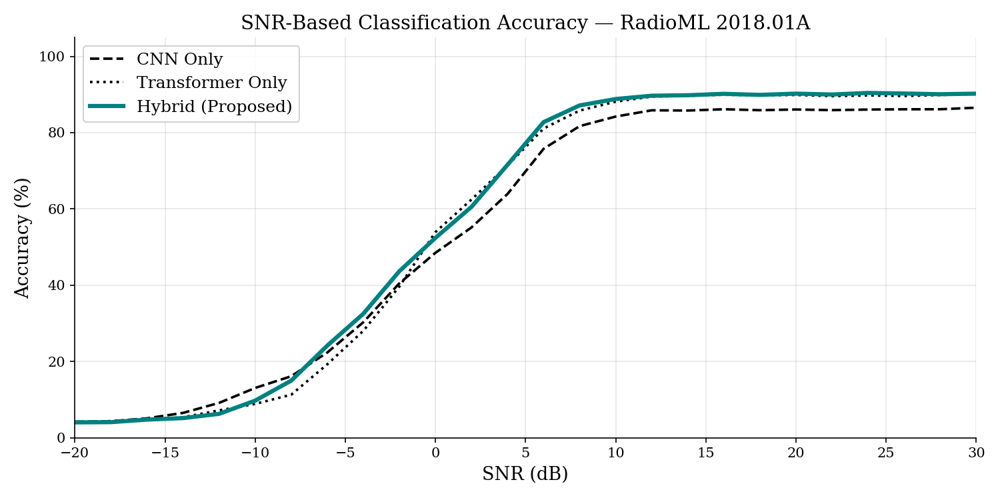
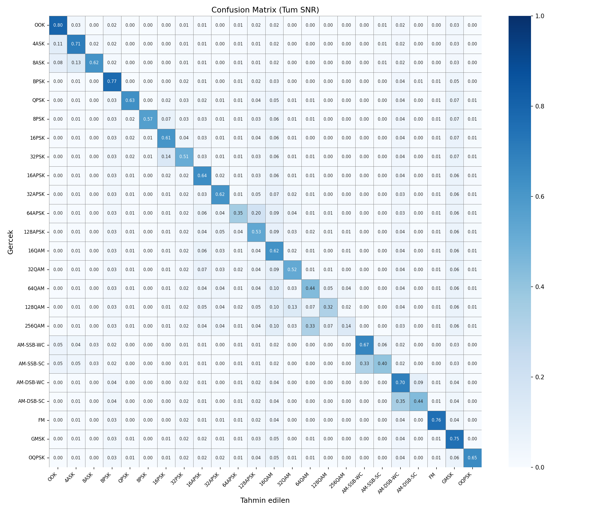

# AI-Based RF Signal Classification for Electronic Warfare Scenarios

*Started as a TED University CMPE490 project*

A Hybrid CNN-Transformer architecture for Automatic Modulation Classification (AMC), built for electronic warfare scenarios. The model combines a CNN branch (local I/Q feature extraction) with a Transformer branch (long-range temporal dependencies) and is benchmarked against CNN-only and Transformer-only baselines on the DeepSig RadioML 2018.01A dataset, covering 24 modulation types across 26 SNR levels (-20 dB to 30 dB).

## 📊 Results

### Final Validation Accuracy

| Model | Epochs Trained | Val. Accuracy |
|---|---|---|
| CNN (baseline) | 100 | 54.6% |
| Transformer (baseline) | 6 | 56.6% |
| **Hybrid CNN-Transformer (proposed)** | 24 | **58.3%** |

The hybrid model matches or exceeds the 100-epoch CNN baseline in roughly a quarter of the training time, converging faster while reaching higher accuracy.

### Accuracy vs. SNR



At higher signal-to-noise ratios (≥10 dB) — the regime most relevant to real-world EW scenarios — the hybrid model reaches **~88-90% accuracy**, outperforming the CNN-only baseline (~86%) and showing the clearest separation in the -5 dB to 5 dB transition region. Performance naturally degrades at very low SNR (<-10 dB), where noise dominates the signal for all models — an expected and well-documented limitation in the AMC literature, not a model-specific weakness.

### Confusion Matrix (Hybrid Model)



Most modulation types are classified cleanly. Remaining confusion concentrates in two known-hard regions: adjacent high-order QAM classes (64/128/256QAM) and AM-DSB-SC vs. AM-DSB-WC — both are recognized challenges in automatic modulation classification due to their similar signal statistics.

## 🗂️ Dataset

RadioML 2018.01A — download into the `data/` folder:

```
python data/download_dataset.py
```

## 🚀 Setup

```
conda create -n rf_class python=3.10 && conda activate rf_class
pip install -r requirements.txt
```

## 🏋️ Training

```
python train.py --model cnn       # Baseline CNN
python train.py --model hybrid    # Hybrid CNN-Transformer
```

## 📈 Evaluation

```
python evaluate.py --model hybrid --compare cnn
```

## 📁 Project Structure

```
rf_classification/
├── config.py                        # All hyperparameters
├── train.py                         # Training loop
├── evaluate.py                      # Evaluation and plots
├── data/
│   ├── dataset.py                   # PyTorch Dataset + DataLoader
│   └── download_dataset.py          # Dataset download instructions
├── models/
│   ├── cnn_baseline.py              # Baseline 1D CNN
│   └── hybrid_cnn_transformer.py   # Main hybrid model
├── checkpoints/                     # Saved models
└── results/                         # Plots and results
```
